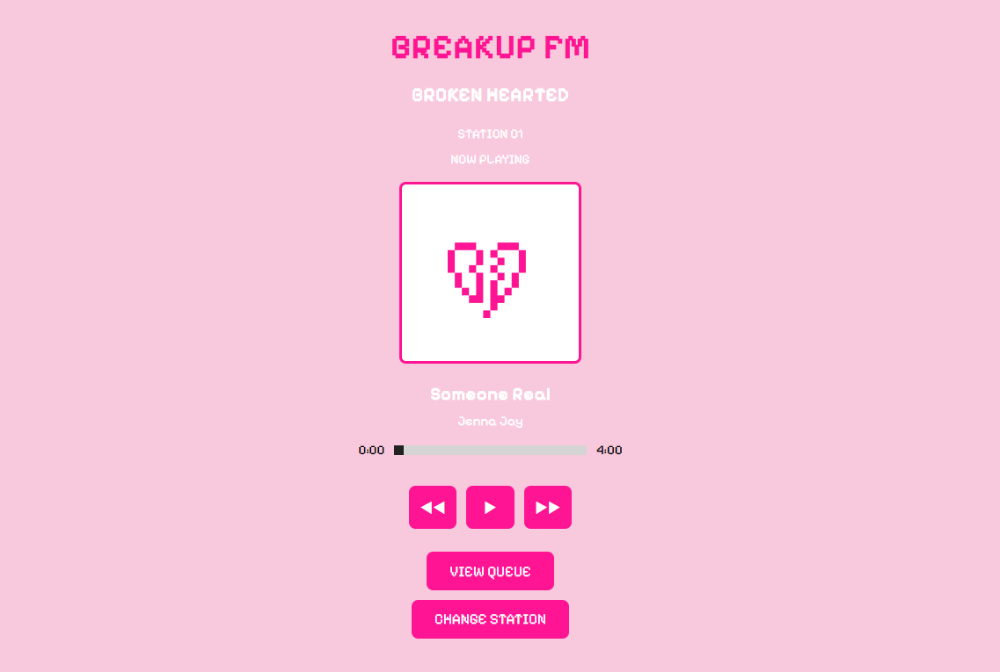
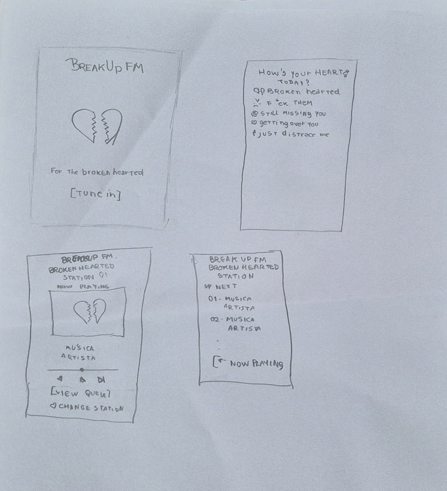
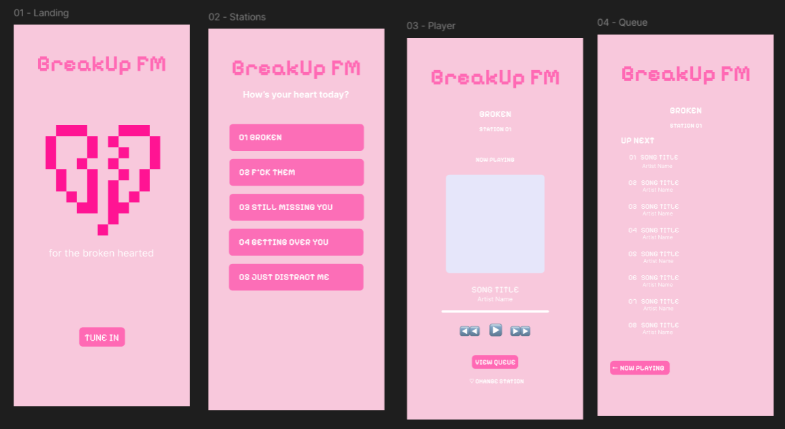

# 💔 BREAKUP FM

> **for the broken hearted.**

## 🌐 Live Demo

Listen to Breakup FM online: **[Open Breakup FM](https://sarahcore.github.io/breakup-fm/)**

Breakup FM is a Y2K-inspired web radio created for those moments when you don't know what to listen to — but you know exactly how you feel.

Instead of searching for individual songs, users choose a station based on their current mood and let the radio take over.



## 📻 About the Project

Breakup FM started from a simple idea: sometimes choosing music is harder than just pressing play.

The project explores a different approach to music discovery by organizing the listening experience around emotions rather than traditional genres or playlists.

The interface was designed around the identity of an imaginary early-2000s radio station, combining pixel-inspired visuals, bright pink tones and a broken-heart motif.

The current prototype focuses on the **BROKEN** station, which represents the sadder side of a breakup.

Other stations are already represented in the interface as part of the concept:

- BROKEN
- F*CK THEM
- STILL MISSING YOU
- GETTING OVER YOU
- JUST DISTRACT ME

The additional stations are intentionally marked as **Coming Soon** in the current version.

## ✨ Features

- Mood-based radio station concept
- Functional music player
- Play and pause controls
- Previous and next track controls
- Interactive progress bar
- Track seeking
- Automatic transition to the next song
- Current song information
- Up Next queue
- Navigation between Player and Queue
- Navigation back to station selection
- Disabled Coming Soon stations
- Responsive web interface

## 🎨 Design Process

Breakup FM was developed from concept to implementation, with the interface being planned before the web version was built.

### 1. Concept

The project began with the idea of creating a radio experience based on emotions rather than music genres.

The visual direction was inspired by early-2000s digital aesthetics, using pixel-style typography, bright pink tones and a broken-heart symbol as the main visual identity.

### 2. Paper Wireframes

Before designing the final interface, I sketched the main screens on paper to define the navigation and basic user flow.

The initial flow included four main screens:

- Landing
- Station Selection
- Player
- Queue

This helped establish the structure of the experience before focusing on visual details.



### 3. Interface Design

After defining the structure on paper, the screens were recreated and refined in Figma.

During this stage, I worked on:

- Visual hierarchy
- Typography
- Color palette
- Button placement
- Navigation between screens
- Radio-inspired visual identity
- Consistency across the interface



### 4. Web Development

The final design was then implemented as a functional web prototype using HTML, CSS and JavaScript.

During development, the static interface became interactive through JavaScript, including music playback, track navigation, queue updates and the progress bar.

## 🛠️ Technologies

- HTML5
- CSS3
- JavaScript
- Figma
- Local font integration
- HTML Audio API

No frameworks or external JavaScript libraries were used.

## 📁 Project Structure

```
breakup-fm/
├── assets/
│   ├── broken-heart.svg
│   └── breakup-fm-preview.png
├── fonts/
│   └── PixelifySans-VariableFont_wght.ttf
├── music/
│   ├── song1.mp3
│   ├── song2.mp3
│   └── song3.mp3
├── index.html
├── style.css
└── script.js
```

## ▶️ How to Run

1. Download or clone this repository.
2. Open the project folder.
3. Open `index.html` in a web browser.
4. Click **TUNE IN** to enter the station selection screen.
5. Select **BROKEN** to start listening.
6. Use the player controls to navigate through the songs or open the queue.

No installation or additional dependencies are required.

## ⚙️ How It Works

The Breakup FM player is controlled with JavaScript.

The project stores the songs in a playlist and keeps track of the currently selected song. When the user interacts with the player, JavaScript updates both the audio and the information displayed on the interface.

The player includes logic for:

- Loading the selected track
- Playing and pausing audio
- Moving to the previous or next track
- Automatically advancing when a song ends
- Updating the progress bar during playback
- Allowing the user to seek through a track
- Updating the current song information
- Displaying the upcoming songs in the queue
- Navigating between the different screens of the experience

HTML provides the structure of the application, CSS defines the visual identity and responsive layout, and JavaScript controls the interactive behavior.

## 🧠 What I Practiced

Through this project, I practiced:

- Structuring a multi-screen web experience
- Connecting HTML, CSS and JavaScript
- Working with JavaScript arrays and objects
- Functions and event listeners
- DOM manipulation
- HTML audio playback
- Managing the current state of a music player
- Updating interface elements dynamically
- Working with progress and time values
- Building navigation between different interface states
- Responsive interface development
- Translating a Figma design into code
- Organizing local assets, fonts and audio files

## 💡 What I Learned

Breakup FM helped me understand how JavaScript can control not only individual interactions, but the state of an entire interface.

Building the music player required keeping the audio, song information, progress bar and queue synchronized. It also showed me how decisions made during the design stage need to be adapted when turning a static interface into a functional product.

The project also gave me experience taking an idea through multiple stages — from initial sketches and interface design to implementation and testing.

## 💗 Design Decisions

Breakup FM was designed to feel more like a fictional radio station than a traditional music streaming platform.

Some of the main design decisions were:

- Using a broken heart as the main visual symbol of the project
- Choosing a bright pink palette to contrast with the sad theme
- Using Pixelify Sans to reinforce the Y2K and digital aesthetic
- Organizing stations around emotions instead of music genres
- Keeping the player interface simple and focused on the current song
- Using a fixed Breakup FM artwork instead of individual album covers
- Allowing the radio to continue playing while navigating between the Player and Queue

The contrast between an energetic visual identity and emotionally sad music is intentional and is part of the personality of Breakup FM.

## 🚀 Future Improvements

The current version is a functional prototype focused on the **BROKEN** station.

Future versions could include:

- Activating the remaining mood-based stations
- Expanding the music library
- Creating unique playlists for each station
- Improving transitions between screens
- Adding volume controls
- Saving the user's current station
- Expanding accessibility and keyboard navigation
- Further refining the responsive experience

## 🎵 Music Credits

The public version of Breakup FM uses music released under licenses that allow reuse and redistribution.

- **Someone Real — Jenna Jay**  
  License: CC0 1.0 Universal  
  Source: [Free Music Archive](https://freemusicarchive.org/music/jenna-jay/single/someone-real-jenna-jay/)

- **YOU MOVED ON, I CAN'T — DJ Endre**  
  License: CC0 1.0 Universal  
  Source: [Free Music Archive](https://freemusicarchive.org/music/dj-endre/single/you-moved-on-i-cant/)

- **Broken Heart — Allerlei von Nicolai**  
  License: Creative Commons Attribution 3.0 Unported (CC BY 3.0)  
  Source: [Free Stock Music](https://www.free-stock-music.com/artist.maliciou.html)

Music remains credited to its respective creators. Third-party audio is included according to the license indicated by its source.

## 👩‍💻 Author

Created by **Sarah Ellen** as part of my learning journey in Computer Engineering and Cybersecurity.

*Learning by doing — turning ideas into things I can build.*
